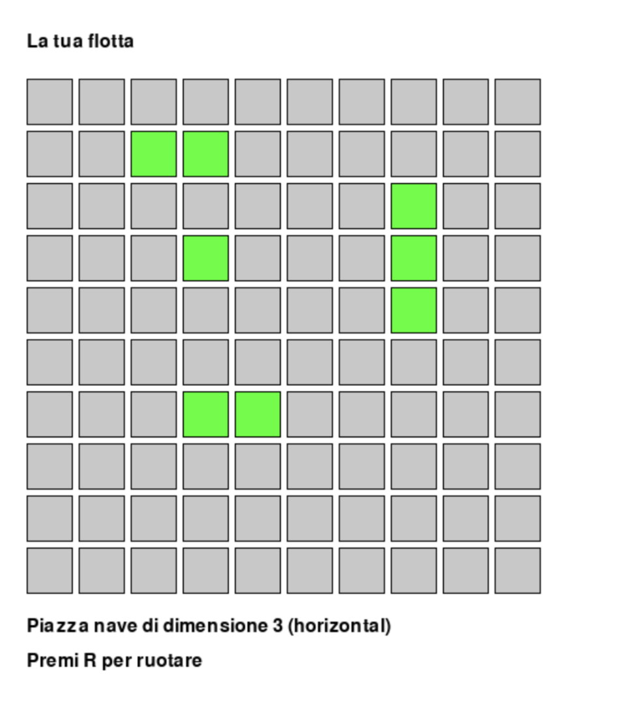
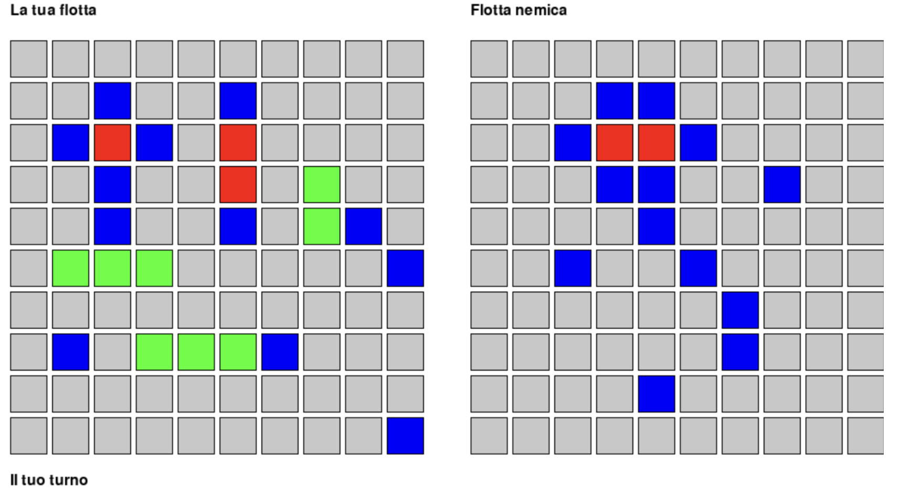

# Battleship — Python + Prolog AI

A fully playable **Battleship** game where the AI opponent is powered by **Prolog logic**, integrated into a **Pygame** graphical interface via **pyswip**.

## Screenshots

### Ship Placement


### Battle


## How it works

The game logic and AI reasoning are implemented entirely in Prolog, queried at runtime from Python using `pyswip`. The AI does not rely on random guessing — it analyses the board state and applies a hierarchy of strategies.

### AI Strategies

**1. Continue along an active ship's direction**  
If two or more active hits (hits not belonging to a sunk ship) are aligned, the AI infers the ship's direction (horizontal or vertical) and continues shooting along that axis.

**2. Shoot adjacent to an isolated active hit**  
If there is a single unsunk hit with no aligned neighbours, the AI shoots one of its four adjacent cells.

**3. Pseudo-random with heuristic (fallback)**  
When no active hits are present (start of game or after sinking a ship), the AI shoots a random valid cell, excluding already-shot positions.

### Prolog knowledge base (inline via pyswip)

Key predicates built at runtime:
- `valid_cell(X, Y)` — grid bounds
- `can_shoot(X, Y)` — unshot valid cell
- `hit(X, Y)` / `shot(X, Y)` — asserted after each turn
- `ship_sunk(ShipId)` — asserted when all cells of a ship are hit
- `active_hit(X, Y)` — hit not belonging to a sunk ship
- `active_ship_direction(...)` — infers horizontal/vertical from aligned active hits
- `continue_active_horizontal/vertical(...)` — next target along the inferred axis

## Game settings

| Setting | Value |
|---|---|
| Grid size | 10×10 |
| Ships per player | 5 |
| Ship sizes | 1, 2, 2, 3, 3 |
| Directions | Horizontal, Vertical |
| Players | Human vs AI |

## Requirements

```bash
pip install pygame pyswip
```

> **Note:** `pyswip` requires SWI-Prolog installed on your system.  
> Install it from [swi-prolog.org](https://www.swi-prolog.org/Download.html).

## Run

```bash
python main.py
```

- Click to place ships, press **R** to rotate
- Click on the enemy grid to shoot during your turn

## Academic context

Developed as a project for the **Artificial Intelligence** course — M.Sc. in Applied Computer Science, University of Naples Parthenope.
